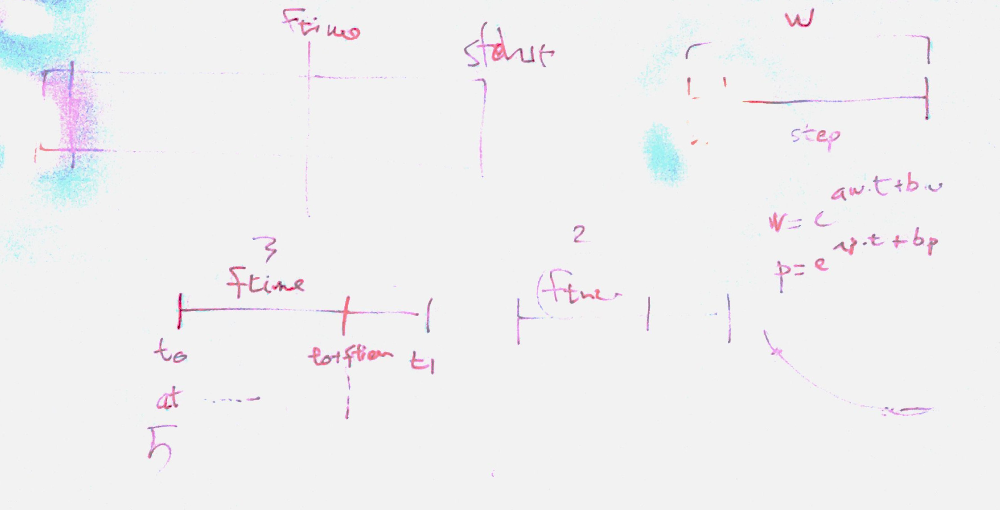

# Lezione di lunedì 11 dicembre 2016

## Cose fatte

* verifica del compito per casa
  * realizzare con funzione esponenziale
  * realizzare con funzione logaritmica
* incapsulamento della funzione

## Compiti per casa

* realizzazione incapsulata con frequenze diverse
* (*più difficile*): realizzazione con constraint di tempo stringenti
  (funzioni non devono approssimare ma coincidere esattamente)
