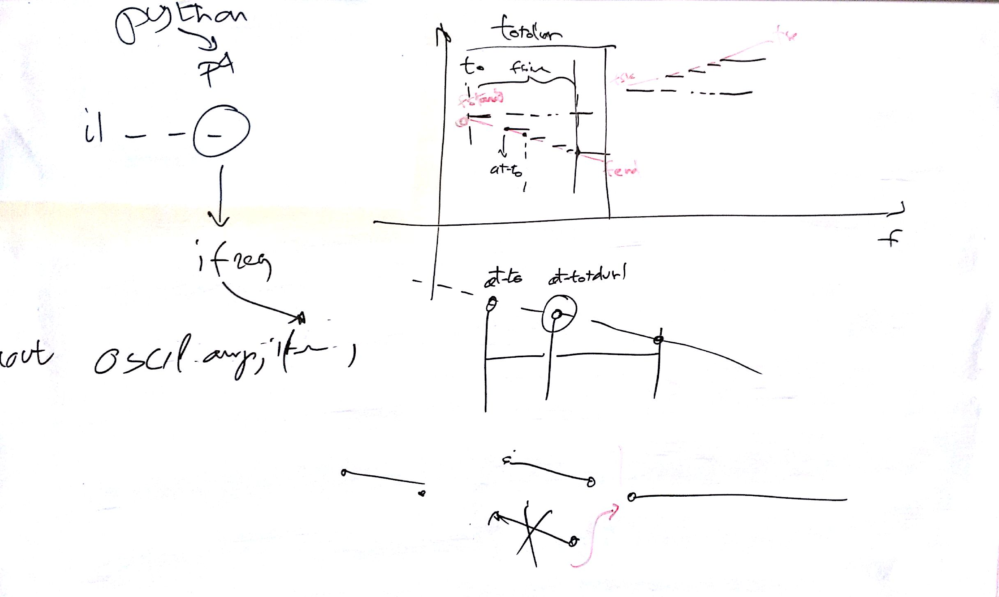

# Lezione di lunedì 25 gennaio 2016

## Cose fatte

* verifica del compito per casa
  * realizzazione incapsulata con frequenze diverse

## Compiti per casa

* correzione dell'algoritmo per coincidere esattamente con i tempi voluti
