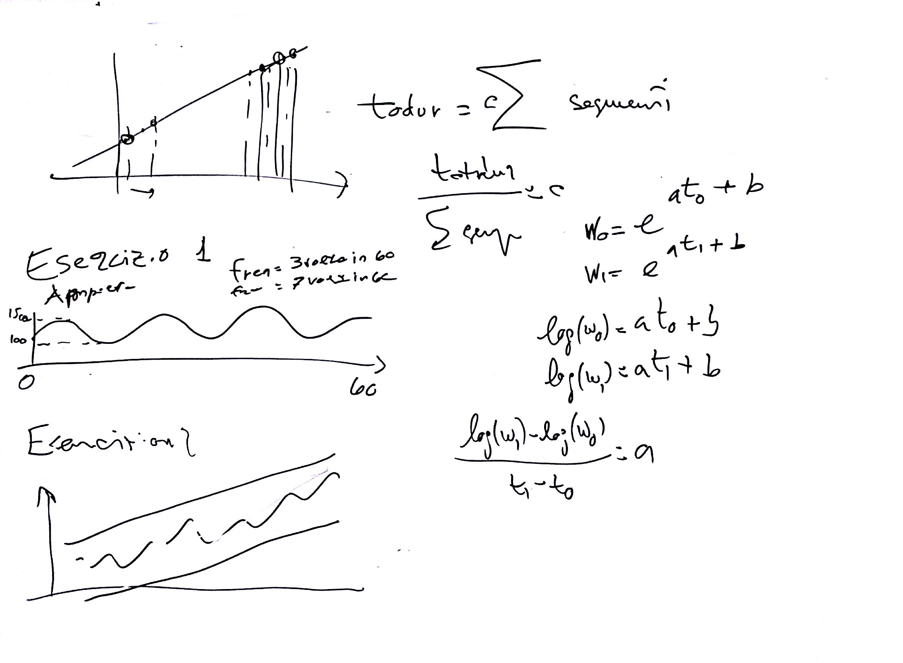

# Lezione di lunedì 08 febbraio 2016

## Cose da fare

* verifica del compito per casa
  * correzione dell'algoritmo per coincidere esattamente con i tempi voluti
* task:
  * realizzare meta partitura
  * introduzione a octave ai polinomi di grado più alto (curve con più punti)
  * contrappunto di battimenti

## Compiti per casa

* Esercizio 1
  * realizzare l'esercizio fatto in classe con modulazione d'ampiezza di
    frequenza compresa tra 3 e 7 cicli **per minuto** e ampiezza compresa tra
    100 e 1500 (in ampiezza lineare)
* Esercizio 2
  * aggiungere all'Es.1 anche l'elaborazione delle frequenze (casuali) in fasci di
    glissandi
