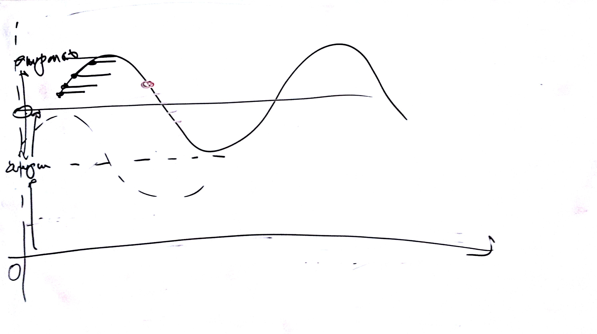
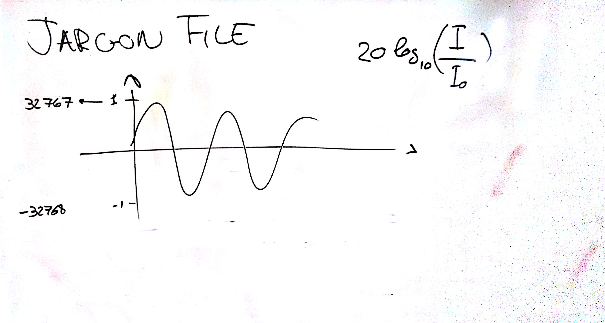

# Lezione di lunedì 15 febbraio 2016

## Argomenti

* verifica del compito per casa
  * realizzare l'esercizio fatto in classe con modulazione d'ampiezza e fasci di
    glissandi

## Compiti per casa

* realizzare l'esercizio fatto in classe con modulazione d'ampiezza che
  *segua* la generazione delle singole note (i.e. ampiezza non tutta uguale
  per ogni nota di un gruppo)
