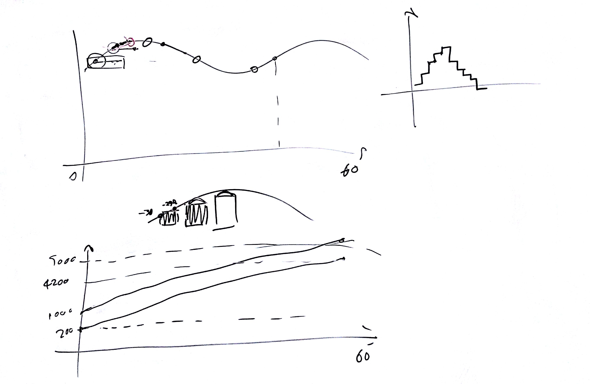

# Lezione di lunedì 7 marzo 2016

## Argomenti

* realizzare l'esercizio fatto in classe con modulazione d'ampiezza che
  *segua* la generazione delle singole note (i.e. ampiezza non tutta uguale
  per ogni nota di un gruppo)

## Compiti per casa

* realizzare una fascia di frequenze random crescenti linearmente in 60
  secondi da 200-1000 Hz sino a 4200-5000 Hz
