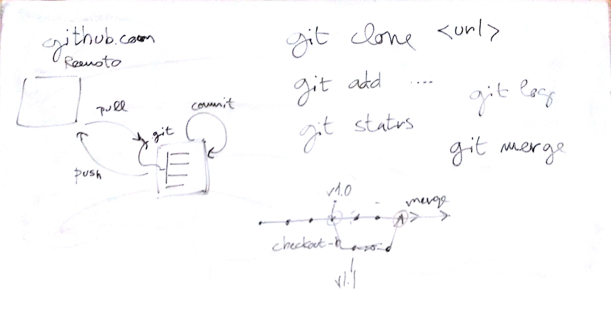
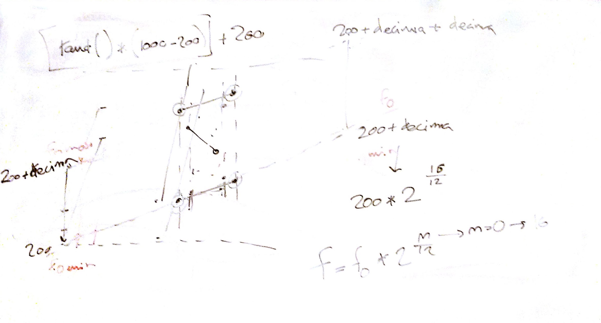
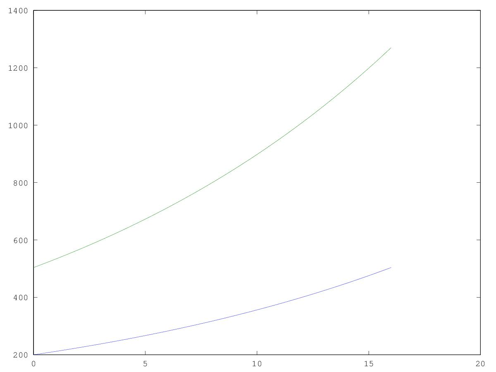

# Lezione di lunedì 21 marzo 2016





## Argomenti

* ripasso comandi `git`, riportati [qui](./git_commands.md)
* verifica del compito per casa
  * realizzare una fascia di frequenze random crescenti linearmente in 60
    secondi da 200-1000 Hz sino a 4200-5000 Hz
* discussione problematiche risultanti
* realizzazione della funzione `MinMax` in `octave`:
```octave
  f0=200
  f1=f0*(2^(4/3))
  n= [0:0.01:16];
  f=f0*(2.^(n/12));
  f1max=f1*(2^(4/3))
  falta=f1*(2.^(n/12));
  plot (n,f,n,falta)
```

## Compiti per casa

* realizzazione di una fascia di frequenze random crescenti geometricamente in
  60 secondi da 200-200+una decima a 200+una decima-200+(una decima)^2,
  come segue:

