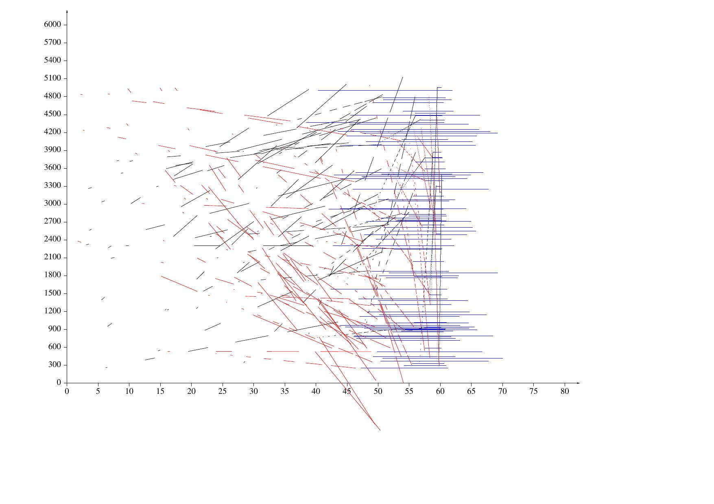

# Lezione di lunedì 4 aprile 2016

## Argomenti

* verifica del compito per casa
  * realizzazione di una fascia di frequenze random crescenti geometricamente in
    60 secondi da 200-200+una decima a 200+una decima-200+(una decima)^2,
    (vedi schemi [lezione precedente](../20160321/README.md))
* task:
  * realizzazione di partitura in linguaggio `pic`
```python
import fileinput
width= 50.0
height= 36.0
dur= 80.0
fmax= 6000.0
tconv= width/dur
fconv= height/fmax
print ".PS\nscale=2.54\nFrame: box width %4.1f height %4.1f invis" % (width, height)
print "Freq: arrow from Frame.sw to Frame.nw + (0, 1.5)"
print "Time: arrow from Frame.sw to Frame.se + (1.5, 0)"
TimeTic= 5.0
FreqTic= 300.0
t=0
f=0
while (t <= dur):
        tt=t*tconv
        print "L%d: line from Time.w + (%8.4f, 0) to Time.w + (%8.4f, -0.3)" % (int(tt), tt, tt)
        print "sprintf(\"%%.0f\", %8.4f) with .n at L%d.s + (0, -0.6)" % (t, int(tt))
        t=t+TimeTic
while (f <= fmax):
        ff=f*fconv
        print "M%d: line from Freq.s + (0, %8.4f) to Freq.s + (-0.3, %8.4f)" % (int(ff), ff, ff)
        print "sprintf(\"%%.0f\", %8.4f) with .e at M%d.s + (-0.6, 0) rjust" % (f, int(ff))
        f=f+FreqTic
         
for line in fileinput.input():
        if line.find("i1")==0:
                fields= line.split()
                (instr, at, dur, fstart, fend)= fields[0:5]
                fend= fend.replace(';', '')
                at=float(at)
                dur=float(dur)
                fstart=float(fstart)
                fend=float(fend)
                if fstart>fend:
                        colour= "red"
                elif fstart<fend:
                        colour= "black"
                else:
                        colour= "blue"
                print "line from Frame.sw + (%8.4f, %8.4f) to Frame.sw + (%8.4f, %8.4f) outline \"%s\"" % (at*tconv, fstart*fconv, (at+dur)*tconv, fend*fconv, colour)

print ".PE"
```
  la quale, attraverso il comando `cat 100note.sco | python Disegna.py | groff -p | ps2pdf - > 100.note.pdf`, produce:
  

## Compiti per casa

* adottare scala logaritmica per le frequenze
