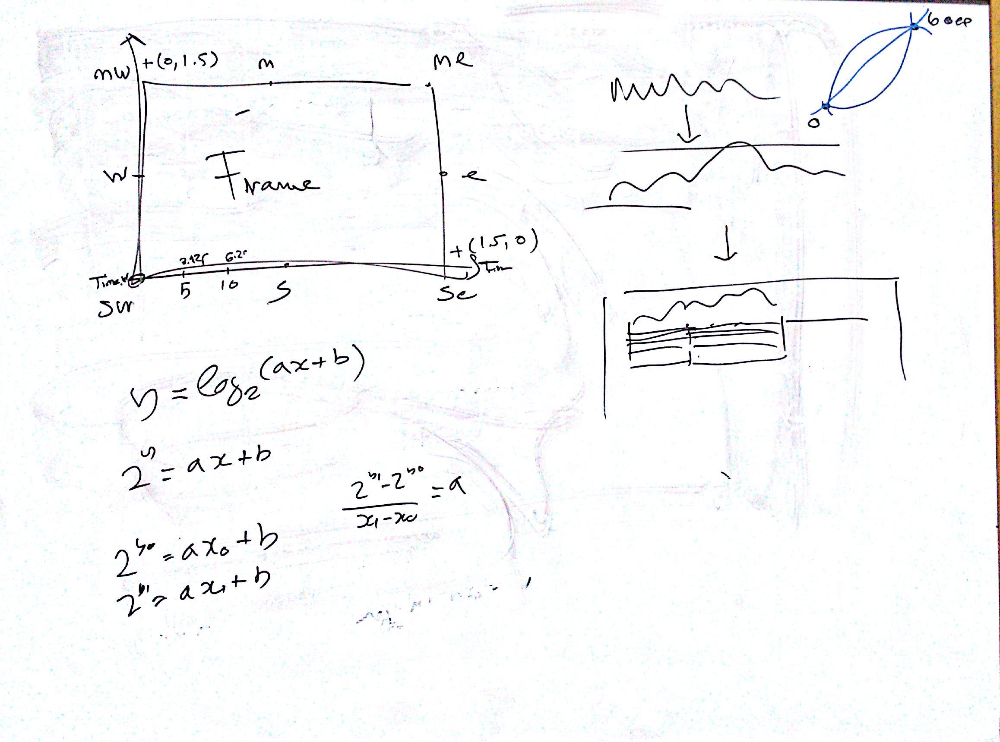

# Lezione di lunedì 18 aprile 2016



## Argomenti

* realizzazione di una partitura grafica in `pic`
  attraverso il programma `Disegna.py`:
```python
import fileinput
import math
width= 50.0
height= 36.0
dur= 80.0
fmax= 6000.0
fmin= 280.0
tconv= width/dur
fconv= height/(fmax-fmin)
base= 0.915
def pow2(value):
	return math.pow(base, value)
def log2(value):
	return -math.log(value+0.00001)/math.log(base) 
fmaxcm= height*fconv
fmincm= fmin*fconv
afact= (pow2(fmaxcm)-pow2(fmincm))/(fmaxcm)
bfact= pow2(fmaxcm)-(afact*fmaxcm)
def geom(freq):
	return log2(afact*freq+bfact)
def limit0(value):
	res= value
        if value<fmin:
		res= fmin
	return res
print ".PS\nscale=2.54\nFrame: box width %4.1f height %4.1f invis" % (width, height)
print "Freq: arrow from Frame.sw to Frame.nw + (0, 1.5)"
print "Time: arrow from Frame.sw to Frame.se + (1.5, 0)"
TimeTic= 5.0
FreqTic= 500.0
t=0
f=fmin
while (t <= dur):
        tt=t*tconv
        print "L%d: line from Time.w + (%8.4f, 0) to Time.w + (%8.4f, -0.3)" % (int(tt), tt, tt)
        print "sprintf(\"%%.0f\", %8.4f) with .n at L%d.s + (0, -0.6)" % (t, int(tt))
        t=t+TimeTic
while (f <= fmax):
        ff= geom(f*fconv)
        print "M%d: line from Freq.s + (0, %8.4f) to Freq.s + (-0.3, %8.4f)" % (int(f), ff, ff)
        print "sprintf(\"%%.0f\", %8.4f) with .e at M%d.s + (-0.6, 0) rjust" % (f, int(f))
        f=f+FreqTic
         
for line in fileinput.input():
        if line.find("i1")==0:
                fields= line.split()
                (instr, at, dur, fstart, fend)= fields[0:5]
                fend= fend.replace(';', '')
                at=float(at)
                dur=float(dur)
                fstart=limit0(float(fstart))
                fend=limit0(float(fend))
                if fstart>fend:
                        colour= "red"
                elif fstart<fend:
                        colour= "black"
                else:
                        colour= "blue"
                print "line from Frame.sw + (%8.4f, %8.4f) to Frame.sw + (%8.4f, %8.4f) outline \"%s\"" % (at*tconv, geom(fstart*fconv), (at+dur)*tconv, geom(fend*fconv), colour)

print ".PE"
```
* che produce il seguente disegno:


