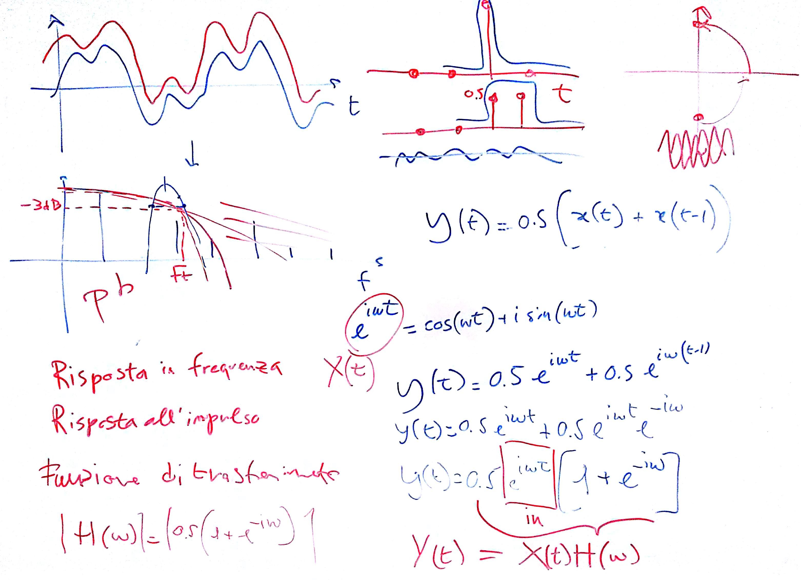
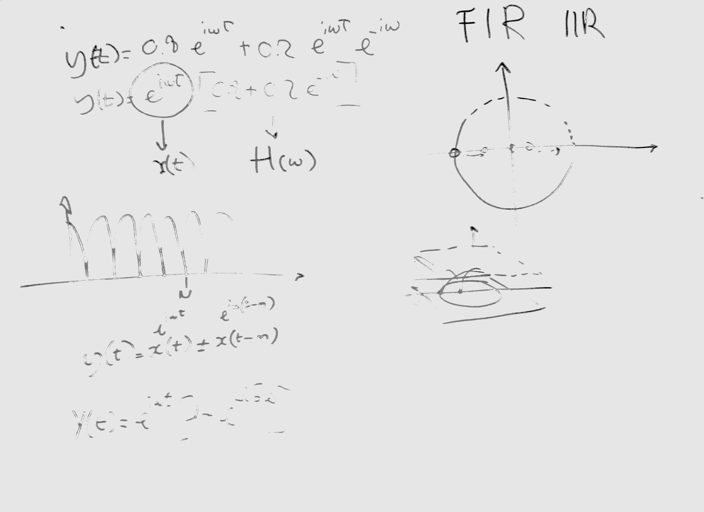

# Lezione di lunedì 23 gennaio 2017

## Argomenti

* introduzione ai filtri digitali:
  * concetto di filtro - caratteristiche:
    * risposta all'impulso
    * funzione di trasferimento
  * filtro passa basso a uno zero (filtro di media)
    * modello matematico
  * filtri comb
    * modello matematico
