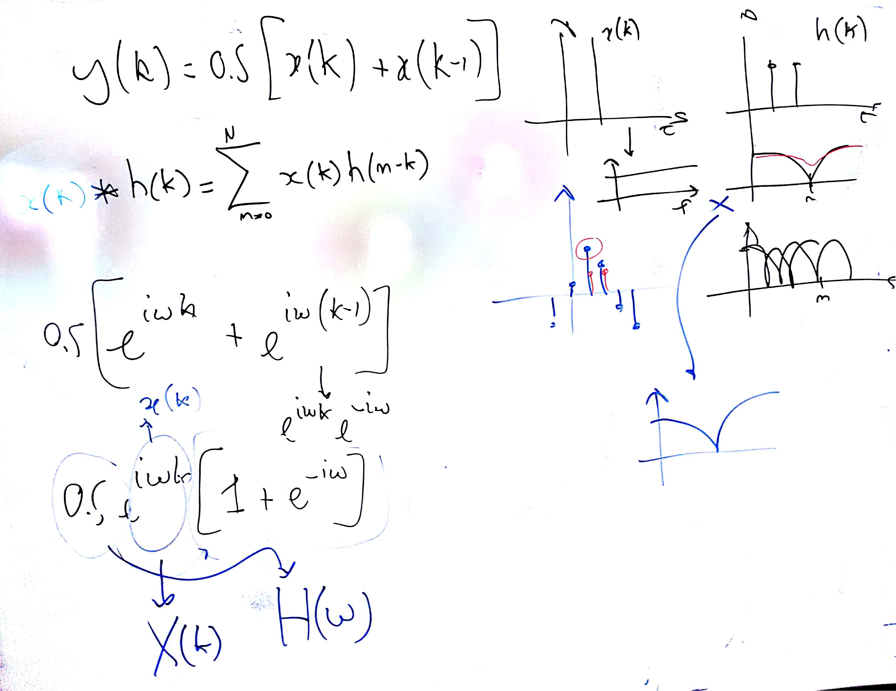

# Lezione di lunedì 20 febbraio 2017

## Argomenti

* filtri FIR di ordine superiore al primo
* realizzazione di un filtri passabasso *quasi* ideale
* calcolo dei coefficienti facendo la trasformata inversa di Fourier della risposta
  all'impulso
